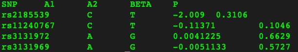
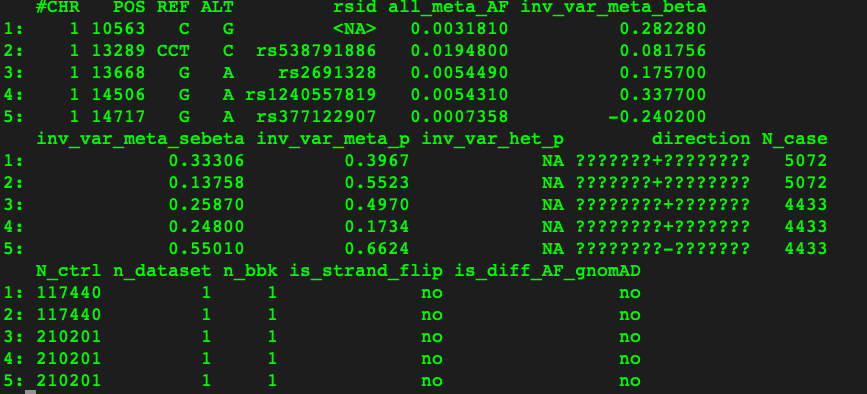
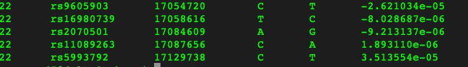

# Pipeline for running PRS-CSx

 

## 1. Prerequisites

### 1.1 Software
- R >= 3.6
- R packages
  - install.packages("data.table")
  - install.packages("pROC")
  - install.packages("boot")
  - install.packages("optparse")
- Python 2 or Python 3 
- Python packages
  - [scipy](https://www.scipy.org/) 
  - [h5py](https://www.h5py.org/) 
- [Plink 1.*](https://www.cog-genomics.org/plink2) or [Plink 2.0](https://www.cog-genomics.org/plink/2.0/) software
- [PRScs](https://github.com/getian107/PRScs) software

### 1.2 Download data resources
- [LD reference panels](https://github.com/getian107/PRScs) for running PRS-CSx
  - Download all ancestry-matched LD reference panels, e.g, for [1KG-EUR](https://www.dropbox.com/s/mt6var0z96vb6fv/ldblk_1kg_eur.tar.gz?dl=0), run `wget https://www.dropbox.com/s/mt6var0z96vb6fv/ldblk_1kg_eur.tar.gz?dl=0` in your specific directory, then `tar -zxvf ldblk_1kg_eur.tar.gz`
- Leave-YOUR-BIOBANK-out GBMI GWAS summary statistics **for each ancestry** 
  - For 14 endpoints, including `AAA AcApp Asthma Appendectomy COPD Gout HCM HF IPF POAG Stroke ThC UtC VTE`
- Download the analysis scripts in the [git repository](https://github.com/globalbiobankmeta/PRS)
  - For example: run `git clone https://github.com/globalbiobankmeta/PRS.git` in your specific directory
  
### 1.3 QC steps
- QC for test/target cohort in each ancestry in your specific Biobank.
  - Genotype QC: e.g., MAF > 1%, imputation INFO score > 0.3 (or biobank-specific, e.g., 0.7), genotype missing rates < 5%, p-value of Hardy-Weinberg equilibrium > 1e-6
  - Individual QC: Remove individuals with missing rates > 10%, only **unrelated individuals with SNP-derived genetic relatedness < 0.05** are used in the following prediction analyses.
- QC for GBMI GWAS sumstats will be implemented in the following Step 2. Details are shown [here](https://docs.google.com/document/d/1CU8l6HavYPA8zHeqpbCco7eqMeDNFfoCDZb83QX-rkw/edit).

 

## 2. Format your GWAS sumstats

In the script `toPRScsFormat.sh`, we will filter out variants in GBMI GWAS sumstats as described [here](https://docs.google.com/document/d/1CU8l6HavYPA8zHeqpbCco7eqMeDNFfoCDZb83QX-rkw/edit). Then, we will reformat your GWAS sumstats with the format as: `SNP A1 A2 BETA P` to prepare for running PRScs, as shown:

 

 After filling the variables in  `toPRScsFormat.sh`, specifically:
 
 -  `sumstats`: Full path and file name to your downloaded GWAS sumstats.
 -  `headers`: The column names of GWAS sumstats for "SNP,A1,A2,BETA,P" in the exactly same order, separated by comma. e.g., "rsid,ALT,REF,inv_var_meta_beta,inv_var_meta_p" as shown:
 

 

Then you can run  `bash toPRScsFormat.sh`. You will get the output with "_toPRScs.txt" in the same folder of your GWAS sumstats. The whole process takes around 10 minutes, 25GB to finish with 1 thread/CPU for most phenotypes.

 

**Note** that if you run this script for public GWAS sumstats, please edit the QC part in `toPRScsFormat.R` correspondingly.

 

## 3. Run PRS-CSx

You have to fill the variables in  `run_prscsx_auto.sh`  which are described in [PRScs github page](https://github.com/getian107/PRScsx). Specifically:

- `PATH_TO_REFERENCE`: Full path (including folder name) to the directory that contains information on all the LD reference panels (the snpinfo file and hdf5 files). e.g., `YOUR_PATH/ldblk_1kg_eur,YOUR_PATH/ldblk_1kg_afr or YOUR_PATH/ldblk_ukbb_eur,/ldblk_ukbb_afr`. 
- `VALIDATION_BIM_PREFIX`: Full path and the prefix of the *.bim file after running QC on the target cohort for each ancestry in your specific Biobank.
- `SUM_STATS_FILE`: Full path and the file name to the GWAS sumstats generated by Step 2 with suffix including "_toPRScs.txt".
- `GWAS_SAMPLE_SIZE`: Effective GWAS sample size here is used. **Please use the corresponding effective sample sizes generated by Wei Zhou [here](https://drive.google.com/file/u/1/d/1PM7qedvb3cCuhn50LDa2hrbQs1TuC9wD/view?usp=sharing).**
- `OUTPUT_DIR`: Directory and prefix of the output files which will be generated by PRScs.
- `N_THREADS`: number of CPUs/threads used in your job.
- `PATH_TO_PRSCS_DIR`: Full path to where you installed PRScs. You can remove this variable if you `export PATH="YOUR_PATH_InstallPRScs:$PATH"` in your .bashrc file.
- `chrom`: running PRScs by chromosome in parallel or array/batch job is recommended. You have to modify `chrom=${TASK_ID}` accordingly to your cluster setting, e.g., chrom=${ARRAY_ID}. If you cannot run batch jobs, you can use for loop to submit one job for one chromosome each time. 

> Note you should modify `python3` to the python version you are using if needed. Please change the number of `GWAS_SAMPLE_SIZE` and `SUM_STATS_FILE` based on the number of input GWAS sumstats. Please make sure `PATH_TO_REFERENCE`, `GWAS_SAMPLE_SIZE` and `SUM_STATS_FILE` are in the same order. 

 

Then you can run PRS-CSx-auto using  `bash run_prscsx_auto.sh`. You are expected to get the output file (similar to *_pst_eff_a1_b0.5_phiauto_chr22.txt) for each chromosome shown as below:

 

## 4. Calculate PRS using plink

> **Note that you should first QC for variants with imputation INFO score > 0.3 (or biobank-specific thresholds) and other filters such as \--maf 0.01 \--geno 0.05 \--hwe 1e-6 and QC for individuls: \--mind 0.1 in your target dataset. Only unrelated individuals with genetic relatedness < 0.05 are used.**

Please fill in the variables in `run_prs.sh` using plink 1.* or `run_prs_plink2.sh` using plink 2.0. Specifically:

 -  `bfile`: Full path and prefix to plink files in .bed .bim .fam format
 -  `scorefile`: Full path and file name to the file generated by PRS-CSx in **`Step 3`**.
 -  `outdir`: Full path and prefix to your output **.profile or .sscore** files generated by plink.
 
 

 
Plink/Plink2 is activated to run `--score` using  `bash run_prs.sh` or `bash run_prs_plink2.sh` and generates outputs of suffix with ".profile" or ".sscore"

 

## 5. Merge score files for each chromosome

> **Note:** If you generated *.profile* or *.sscore* files by each chromosome, which is recommended when you have a large target cohort, then you have to merge them first before calculating the accuracy of PRS. You can skip this step if you did not split chromosomes to generate PRS.

You can merge the *.profile* or *.sscore* score files by running `merge_scoreFiles.sh` after filling the variables, specifically:

 -  `wkdir`: Full path to the directory with `*.profile*` or `*.sscore*` score files generated by plink
 -  `file_pattern`: a **regex pattern** in order to list score files for 22 chromosomes
 -  `out_file`: Full path and file name to your output with **`suffix .profile/.sscore`** files for combined PRS

Then you can run  `bash merge_scoreFiles.sh`.

 

## 6. Calculate the PRS accuracy metrics

 

**Generally, we use a validation dataset to get the weights of each PRS and then generate a weighted PRS to get its accuracy in the independent test dataset. **

 

After filling the variables in the script `create_prs_metrics_weighted.R`. Specifically:

- `files`: Full path and file names listing  *.profile or .sscore* files generated by plink, separated by comma
- `pop`: Target ancestry, labelled as **NFE FIN AMR CSA MID EAS AFR** used in GBMI analyses.
- `pheno`: Phenotype name in the phenotype file.
- `prop`: Proportion of total samples selected to tune the parameter or get the weight, from 0 to 1.
- `reps`: The number of replications repeated of data splitting
- `K`: Disease prevalence, default is **NULL** and the script will use the proportion of cases in the target population instead.
- `covs`: Covariates included in the prediction model, separated by comma, e.g., "Age,Sex". **Note the covariates here are separated from PCs , using the same covariates included in GWAS analyses is recommended**. 
- `pc_numbers`: PCs included in the prediction model, separated by comma. The default is 10 PCs: "PC1,PC2,PC3,PC4,PC5,PC6,PC7,PC8,PC9,PC10". **Note using the same covariates included in GWAS analyses is recommended**.
- `phenofile`: Full path and file name to the phenotype file (headers including FID, IID, phenotypes etc.)
- `popfile`: Full path and file name to the file listing IDs for **unrelated individuals** in the target population (in the format of FID, IID as the first two columns)
- `covfile`: Full path and file name to the file including covariates (with headers including FID, IID and covariates)
- `pcfile`: Full path and file name to the file including PCs (e.g., headers including FID, IID, PC1, PC2, PC3...)
- `cohort_name`: Your specific Biobank name, e.g., "UKBB"
- `ldref`: The LD reference panel used (e.g., 1KG or UKB)
- `out_weights`: Full path and file name for the output file of the prs accuracy metrics after splitting the dataset to validation and test.
- `wt`: Statistic used as the weight, e.g., NKr2 or h2l_NKr2
- `out_test_metrics`: Full path and file name for the output file of accuracy metrics in the test cohort. Note this is the final output file.

 

Then run `bash run_create_prs_metrics_weighted.sh`, the output files you will get:

- `out_weights`: An intermediate file generating accuracy metrics in each PRS in the validation cohort, which will be used as the weights across a specified replications.
- `out_test_metrics`: The final output file for the accuracy metrics of the weighted PRS in the test cohort across a specified replications.

 

>If you have any issues, please feel free to contact Ying Wang (yiwang@broadinstitute.org).

 

 

